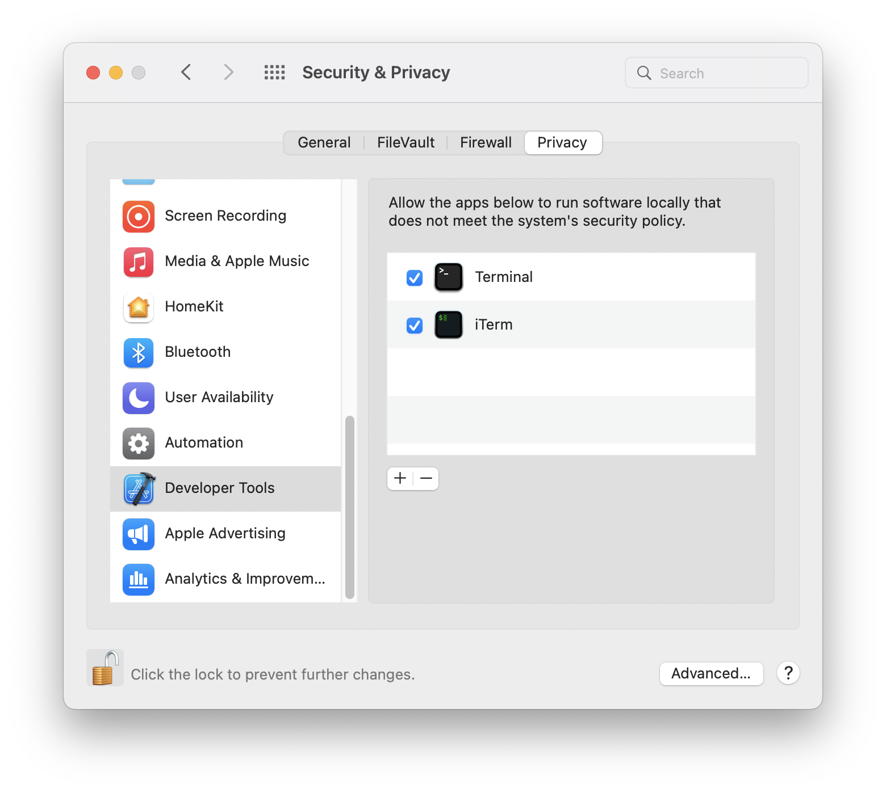
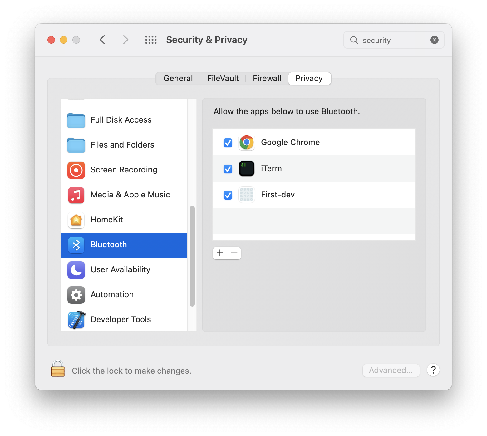

# Endo

The Endo app is a graphical shell for controlling the user's Endo executor daemon.
Since end users will not typically have an Endo executor daemon or its system
dependencies installed, the Endo app is also a vessel for these tools, though
the graphical shell will connect to whatever daemon is currently running.

# Developing Endo

The Endo app uses Socket Supply Co's [`ssc`](https://sockets.sh), Vite, and
React.
Using SSC ensures that the Endo application benefits from the native web view
provided by the underlying operating system, which reduces the risk of security
patches being delayed by intermediate vendors (like Electron or Chromium).
However, SSC alpha grade software (at time of writing, November of 2022)
and some rough edges that developers will need to work around.

You will need to install the SSC toolchain.
Follow the (dangerous) instructions for your operating system on
[sockets.sh](https://sockets.sh).
At time of writing, this produced version `0.1.0 (ac944a6)`.

```console
sha256sum $(which ssc)
> df925d0dd4b6107f8804e791b761e2fb44ed73089ef6839e8d6a7883d22f0db2  /usr/local/bin/ssc
```

Download the entire Exo repository and install its dependencies.
The dependency train will also include versions of Node.js for each supported
operating system, since these must be bundled with the Endo app.
The Endo app post-install script verifies the integrity of the downloaded
Node.js archives against hashes that are checked into this repository.

```console
git clone https://github.com/endojs/exo
cd exo
yarn
```

At this time, to develop the Endo app on Mac OS X, the developer needs to endow
their terminal with the right to launch unsigned applications that attempt to
access Bluetooth.

These instructions apply for Mac OS 10.12, Big Sur, and analogous steps must
be taken on other versions.

Open and navigate the System Preferences application to the Security and
Privacy panel, Privacy tab.

In the Bluetooth and Developer Tools subpanels, add whatever terminal or other
applications you will use to launch Endo.





Use the `ssc build -r` command to build and run a version of the Endo
application that is suitable for development, deferring to the web application
hosted on the local host, port 4747.

```console
ssc build --port=4747 -r
```

Future development sessions can skip the build and just run the existing build.

```console
ssc run
```

And `ssc build` produces a production version of the application, which you
will find in `dist`.

During development of the embedded web application, use the `yarn vite` command
to watch and serve your working copy.

```console
yarn vite --port 4747
```
